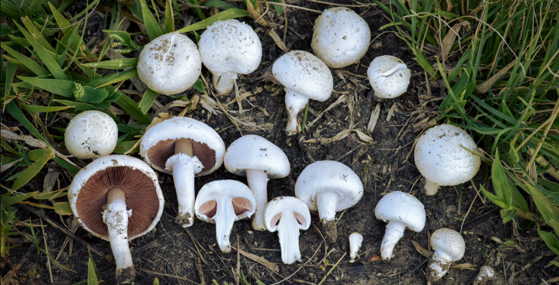

---
output:
  pdf_document: default
theme: Flatly
execute: 
  warning: false
  message: false
  echo: false
editor_options: 
  markdown: 
    wrap: 72
---

# Deep Learning & AutoML in h2o



## Set up

```{r, message = FALSE, warning=FALSE}
# Load libraries
library(h2o)
library(tidyverse)
library(wesanderson)
library(knitr)

# Disable progress bar in document
h2o.no_progress()

# Start h2o cluster
h2o.init(nthreads = -1,
         max_mem_size = '4G')

# Load file 
mushrooms <- read.csv('https://tinyurl.com/hmkhs9au')

# Transform data set for further analysis
mushrooms <- mushrooms %>%
  # Remove not needed characters
  mutate(across(1:23, ~ substr(.x, 3,3))) %>%
  # Change columns from strings to factors
  mutate(across(everything(), as.factor))

# Load data to h2o cluster
mushrooms_hex <- as.h2o(mushrooms, destination_frame = 'mushrooms_hex')

# Split data set to train (75%) & test (25%)
mushrooms_split <- h2o.splitFrame(data = mushrooms_hex, ratios = 0.75)

mushrooms_train <- mushrooms_split[[1]]
mushrooms_test <- mushrooms_split[[2]]
```

## Data

Data set contains 8124 observations of 23 species from Agaricus and
Lepiota families. Beside class (e - edible/p - poisonous or uknown
edibility) there are 22 physical attributes.

## h2o's Deep Learning

```{r, message = FALSE, warning=FALSE}
# Build and train Deep Learning model
mushrooms_dl <- h2o.deeplearning(
                        y = 23,
                        x = 1:22,
                        training_frame = mushrooms_train,
                        validation_frame = mushrooms_test,
                        distribution = 'multinomial',
                        activation = 'RectifierWithDropout',
                        hidden = c(100, 200, 100),
                        input_dropout_ratio = 0.2,
                        l1 = 1e-5,
                        epochs = 55,
                        variable_importances = TRUE,
                        # Set seed for reproducible results:
                        seed = 123)

```

```{r fig.height=3, message=FALSE, warning=FALSE, paged.print=FALSE}
# Learning curve plot
h2o.learning_curve_plot(mushrooms_dl)
```

```{r, message = FALSE, warning=FALSE}
# Confusion matrix
h2o.confusionMatrix(mushrooms_dl, mushrooms_test, valid = FALSE, xval = FALSE)
```

```{r, message = FALSE, warning=FALSE}
# If needed, predictions can be done on test data set
# (which was used for validation in model training)
mushroom_pred <- h2o.predict(object = mushrooms_dl,
                            newdata = mushrooms_test)

# Confusion matrix as simple table: test vs predictions
table(as.data.frame(mushrooms_test[,23])[,1],
      as.data.frame(mushroom_pred[,1])[,1])

```

```{r message=FALSE, warning=FALSE, paged.print=FALSE}
# Importance of parameters
h2o.varimp_plot(mushrooms_dl)
```

Most important parameters are odor and spore print color:

```{r fig.height=2.75, message=FALSE, warning=FALSE, paged.print=FALSE, echo=FALSE}
ggplot(mushrooms, aes(odor)) +
  geom_bar(position="dodge", aes(fill = class)) +
  scale_fill_manual(name = 'Edible/ Poisonous', values = wes_palette('Moonrise2', type = 'discrete')) +
  labs(x = 'Odor', y = 'Count')+
  scale_x_discrete(labels=c('almond', 'creosote', 'foul', 'anise', 'musty', 'none', 'pungent', 'spicy', 'fishy'))
```

```{r fig.height=2.75, message=FALSE, warning=FALSE, paged.print=FALSE, echo=FALSE}
ggplot(mushrooms, aes(spore.print.color)) +
  geom_bar(position="dodge", aes(fill = class)) +
  scale_fill_manual(name = 'Edible/Poisonous', values = wes_palette('Moonrise2', type = 'discrete')) +
  labs(x = 'Odor', y = 'Count')+
  scale_x_discrete(labels=c('buff', 'chocolate', 'black', 'brown', 'orange', 'green', 'purple', 'white', 'yellow'))
```

## AutoML

```{r, message = FALSE, warning=FALSE}
# Run AutoML: max 100 models, max 60 seconds
mushrooms_auoml <- h2o.automl(
                        y = 23,
                        x = 1:22,
                        training_frame = mushrooms_train,
                        max_runtime_secs = 60,
                        max_models = 100)
```

```{r, message = FALSE, warning=FALSE}
# Leader board
df <- h2o.get_leaderboard(object = mushrooms_auoml)
df <- as.data.frame(df)
df$model_id <- substr(df$model_id,1,5)
kable(df)
```

```{r message=FALSE, warning=FALSE, paged.print=FALSE}
# Variables importance heatmap for different AutoML models
h2o.varimp_heatmap(mushrooms_auoml)
```

```{r fig.height=2.5, message=FALSE, warning=FALSE, paged.print=FALSE}
# Effect of odor variable for each model
h2o.pd_multi_plot(mushrooms_auoml, mushrooms_test, "odor")
```

## References

1.  **Data set**:
    <https://www.kaggle.com/datasets/ulrikthygepedersen/mushroom-attributes>
2.  **Agaricus family graphic**:
    <https://en.wikipedia.org/wiki/Agaricus>
3.  **Mushrooms graphics**:
    \<<https://biolwww.usask.ca/fungi/glossary.html>\>
4.  **h2o Deep Learning**:
    <https://docs.h2o.ai/h2o/latest-stable/h2o-docs/data-science/deep-learning.html>
5.  **h2o AutoML**:
    <https://docs.h2o.ai/h2o/latest-stable/h2o-docs/automl.html>
6.  **h2o models explainability**:
    <https://docs.h2o.ai/h2o/latest-stable/h2o-docs/explain.html#explanation-plotting-functions>
